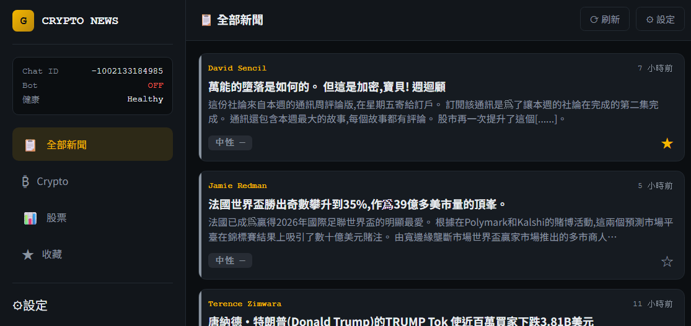
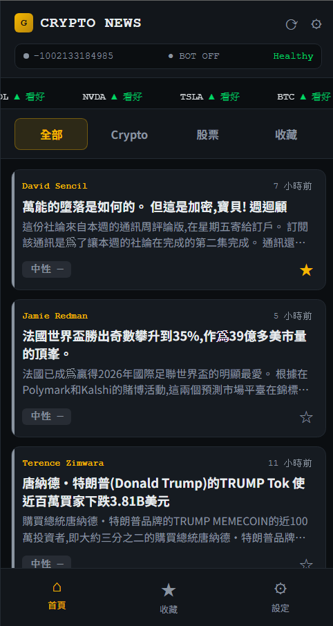

<div align="center">


<br><br>


# 🪙 Crypto News Bot

**搶先市場一步，唔使自己刷新聞**
**Beat the market — without reading a single headline yourself**


</div>

---

## 📖 簡介 · Overview

> 🕐 **你有幾多次因為漏睇一條新聞，錯過止蝕嘅時機？**
> 幣圈新聞一分鐘一堆，冇人可以全部睇晒。Crypto News Bot 幫你自動篩走雜訊，只推送真正影響你倉位嘅新聞——仲即時話你知係利好定利淡。
>
> **How many times have you missed a stop-loss window because you missed one headline?**
> Crypto news moves faster than anyone can read. Crypto News Bot filters the noise automatically and pushes only what actually moves your position — tagged Bullish or Bearish before you even open the app.

<br>

| 🔴 冇用之前 Before | 🟢 用咗之後 After |
|---|---|
| 手動刷十幾個新聞台 <br> Manually scanning a dozen news sites | Bot 自動幫你篩選 <br> Auto-filtered for you |
| 睇完成篇先知係利好定利淡 <br> Read the whole article just to gauge sentiment | 一個標籤即刻話你知 <br> Sentiment tagged instantly |
| 錯過即時消息 <br> Miss the breaking moment | Telegram 秒推到手機 <br> Pushed to your phone in seconds |

<br>

**中文**
Crypto News Bot 係一個自動化嘅加密貨幣 / 股票新聞情報系統。系統會自動爬取最新市場新聞，透過 AI 進行情緒分析（看好 / 看淡 / 中性），並即時推送到 Telegram，同時提供一個手機優先、深色主題嘅 Web UI 畀你隨時瀏覽同管理。

**English**
Crypto News Bot is an automated crypto/stock news intelligence system. It continuously scrapes the latest market news, runs AI-based sentiment analysis (Bullish / Bearish / Neutral), pushes real-time alerts to Telegram, and ships with a mobile-first, dark-themed Web UI for browsing and management.

---

## ✨ 功能 · Features

| 功能 Feature | 說明 Description |
|---|---|
| 📡 自動新聞爬取 <br> Auto News Scraping | 自動爬取加密貨幣新聞 Crypto <br> Continuously crawls crypto news sources |
| 🤖 Telegram 推送 <br> Telegram Push | 即時推送通知到 Telegram Bot <br> Instant alerts via Telegram Bot |
| 💻 Web UI | 手機優先、Dark Theme 介面 <br> Mobile-first, dark theme interface |
| ⭐ 收藏功能 <br> Favorites | 收藏重要新聞方便追蹤 <br> Save important news for later |
| 🏷️ 分類過濾 <br> Category Filter | Crypto / 股票 / 全部 <br> Crypto / Stocks / All |
| 📊 情緒分析標籤 <br> Sentiment Tagging | 看好 / 看淡 / 中性 <br> Bullish / Bearish / Neutral |

---

## 📱 介面預覽 · Screenshots

<div align="center">




<br><br>


</div>

<p align="center"><i>手機優先設計，深色主題，一眼掌握市場情緒<br>Mobile-first design with dark theme — market sentiment at a glance</i></p>

---

## 🚀 快速開始 · Quick Start

**中文步驟**

```bash
# 1. 安裝依賴
pip install -r requirements.txt

# 2. 設定環境變數
# 建立 .env 檔案，填入：
# TELEGRAM_TOKEN=你的 Bot Token
# CHAT_ID=你的 Chat ID

# 3. 啟動服務
python run.py
```

**English Steps**

```bash
# 1. Install dependencies
pip install -r requirements.txt

# 2. Configure environment variables
# Create a .env file with:
# TELEGRAM_TOKEN=your_bot_token
# CHAT_ID=your_chat_id

# 3. Start the server
python run.py
```

瀏覽器打開 · Open in browser：**http://localhost:5000**

---

## 🏗️ 架構 · Architecture

```
crypto-news-bot/
├── run.py              # Flask 主體 + API endpoints / Flask app + API endpoints
├── news/               # 新聞爬取 + 翻譯 / News scraping + translation
├── communication/      # Telegram Bot
├── data/               # CSV Handler
├── web/                # 前端（HTML + CSS + JS，無 framework）
│                        # Frontend (HTML + CSS + JS, no framework)
└── img/                # 圖片資源 / Image assets
    ├── logo.png
    ├── banner.png
    └── ui.png
```

---

## 🔌 API 端點 · API Endpoints

| 端點 Endpoint | 方法 Method | 用途 Description |
|---|---|---|
| `/api/news` | `GET` | 新聞列表 · Get news list |
| `/api/favorites` | `GET` `POST` `DELETE` | 收藏管理 · Manage favorites |
| `/api/settings` | `GET` `POST` | 設定讀寫 · Get/update settings |
| `/api/settings/chat-id` | `POST` | 更新 Chat ID · Update Chat ID |
| `/api/status` | `GET` | Bot 狀態 · Bot status |

---

## 💬 Telegram 命令 · Telegram Commands

| 命令 Command | 說明 Description |
|---|---|
| `/start` | 啟動 Bot · Start the bot |
| `/stop_bot` | 停止 Bot · Stop the bot |
| `/status` | 查看狀態 · Check bot status |
| `/refresh` | 手動刷新新聞 · Manually refresh news |

---

## 📄 授權 · License

MIT License

<div align="center">

Made with ☕ for crypto watchers

</div>
